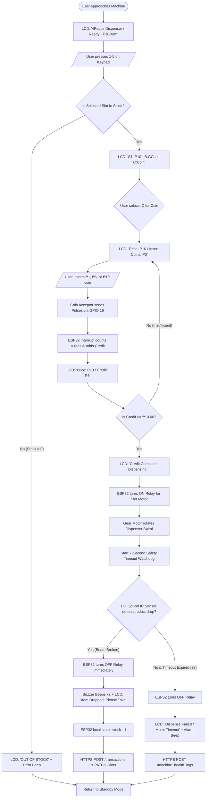
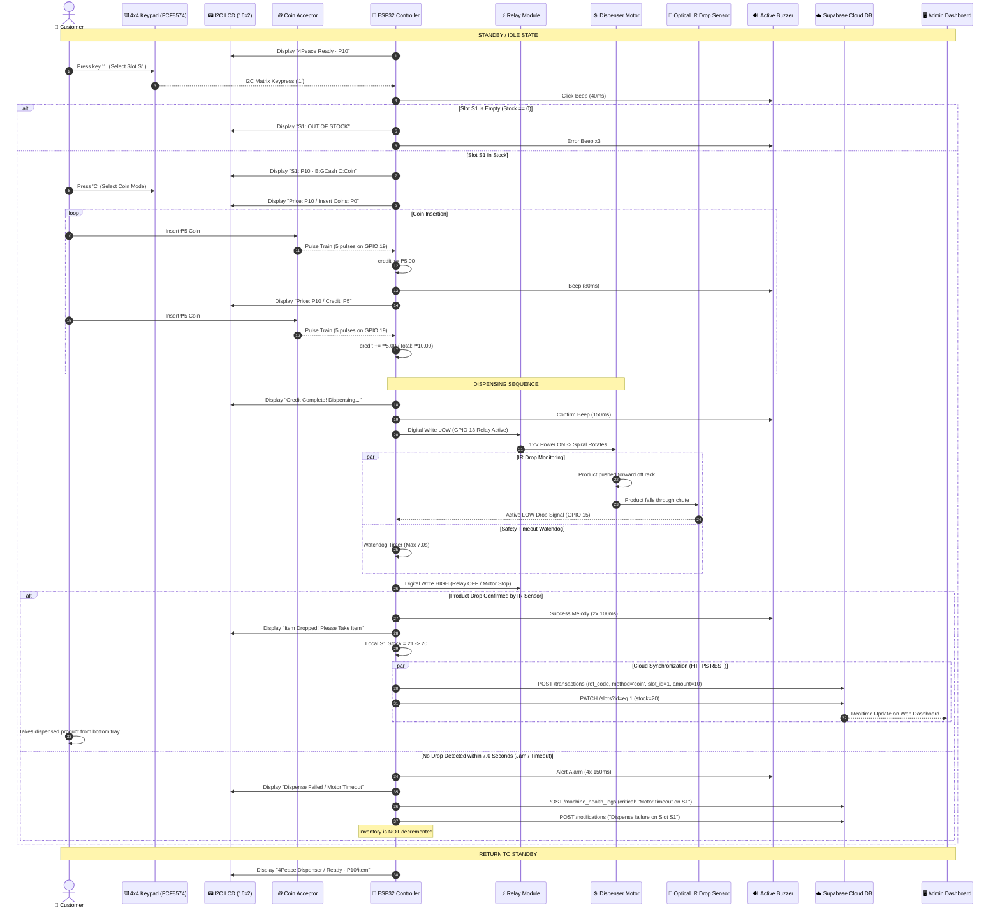

# 🌸 4Peace — Complete Step-by-Step Flow: Coin Insertion to Product Dispatch
### IoT-Based Smart Feminine Hygiene Access System

This document outlines the **complete end-to-end hardware, logic, and cloud synchronization flow** of the 4Peace automated vending machine—from the moment a user approaches the machine and inserts coins, through physical motor dispensing and optical IR drop verification, to cloud transaction recording in Supabase.

---

## 📑 Table of Contents
1. [High-Level Flow Diagram (Mermaid Flowchart)](#-high-level-flow-diagram)
2. [End-to-End Sequence Diagram](#-end-to-end-sequence-diagram)
3. [Step-by-Step Detailed Phases](#-step-by-step-detailed-phases)
   - [Phase 1: Standby & Slot Selection](#phase-1-standby--slot-selection)
   - [Phase 2: Coin Insertion & Hardware Interrupt Counting](#phase-2-coin-insertion--hardware-interrupt-counting)
   - [Phase 3: Relay Actuation & Motor Rotation](#phase-3-relay-actuation--motor-rotation)
   - [Phase 4: Physical Drop Verification via Optical IR Sensor](#phase-4-physical-drop-verification-via-optical-ir-sensor)
   - [Phase 5: Cloud Synchronization & Transaction Logging](#phase-5-cloud-synchronization--transaction-logging)
   - [Phase 6: Reset & Ready State](#phase-6-reset--ready-state)
4. [Error Handling & Failsafe Branches](#-error-handling--failsafe-branches)
5. [Hardware Pinout & Signal Mapping](#-hardware-pinout--signal-mapping)

---

## 📊 High-Level Flow Diagram



---

## 🔁 End-to-End Sequence Diagram



---

## 🔍 Step-by-Step Detailed Phases

### Phase 1: Standby & Slot Selection
1. **Idle Screen:** The 16x2 LCD displays rotating welcome messages:
   - `Line 1: 4Peace Dispenser` / `Line 2: Ready · P10/item`
   - `Line 1: Press 1-5 to Buy` / `Line 2: Coins or GCash`
2. **Keypad Selection:** The customer presses buttons `1`, `2`, `3`, `4`, or `5` on the 4x4 membrane keypad (connected to the PCF8574 I2C expander).
3. **Stock Verification:** The ESP32 checks its local memory `slots[selectedSlotIndex].stock`:
   - If `stock == 0`: LCD displays `OUT OF STOCK`, buzzer sounds 3 error beeps, and the machine cancels the session.
   - If `stock > 0`: LCD prompts `S1: P10 · B:GCash C:Coin`.

---

### Phase 2: Coin Insertion & Hardware Interrupt Counting
1. **Selecting Coin Mode:** The user presses `C` on the keypad.
2. **Credit Screen:** The LCD displays:
   - `Line 1: Price: P10`
   - `Line 2: Insert Coins: P0`
3. **Pulse Generation:** When a coin enters the multi-coin acceptor:
   - **₱1 coin** generates **1 pulse**.
   - **₱5 coin** generates **5 pulses**.
   - **₱10 coin** generates **10 pulses**.
4. **Interrupt Handling (GPIO 19):**
   - Each falling edge triggers the `onCoinPulse()` ISR.
   - A `COIN_PULSE_TIMEOUT_MS` (400ms) timer groups the pulse burst into the correct peso denomination.
5. **Credit Accumulation:**
   - The ESP32 adds the value to `currentCredit` and beeps the buzzer once.
   - The LCD updates in real time: `Credit: P5` ➔ `Credit: P10`.

---

### Phase 3: Relay Actuation & Motor Rotation
1. **Target Met:** Once `currentCredit >= unitPrice` (₱10.00), the ESP32 transitions to `STATE_DISPENSING`.
2. **Display Update:** The LCD shows `Credit Complete! / Dispensing...`.
3. **Relay Trigger:** The ESP32 sets the active LOW relay output for the chosen slot:
   - Slot 1: `GPIO 13`
   - Slot 2: `GPIO 12`
   - Slot 3: `GPIO 14`
   - Slot 4: `GPIO 27`
   - Slot 5: `GPIO 26`
4. **Dispense Motor:** The 12V gear motor begins rotating the spiral coil, pushing the feminine hygiene product toward the front edge of the slot rack.

---

### Phase 4: Physical Drop Verification via Optical IR Sensor
1. **Safety Timer:** The ESP32 initiates a 7000ms (`DISPENSE_TIMEOUT_MS`) watchdog loop.
2. **Optical Drop Zone:** As the product falls off the rack shelf, it passes through the infrared beam of the slot's optical drop sensor (TCRT5000 / Optical Obstacle Sensor).
3. **Beam Break:**
   - The IR sensor output transitions to `LOW` (Active LOW).
   - The function `waitForIrDropConfirmation()` confirms the physical drop.
4. **Immediate Motor Shutdown:** The ESP32 deactivates the relay (`HIGH`) the instant the drop is confirmed—preventing double dispensing.
5. **User Feedback:**
   - Buzzer sounds two confirmation beeps (100ms each).
   - LCD displays `Item Dropped! / Please Take Item` for 3 seconds.

---

### Phase 5: Cloud Synchronization & Transaction Logging
Immediately following drop verification, the ESP32 performs three cloud updates over HTTPS REST to Supabase:

1. **Local Inventory Decrement:**
   ```cpp
   slots[slotIdx].stock--;
   ```
2. **Database Stock Sync (`PATCH /rest/v1/slots`):**
   ```http
   PATCH /rest/v1/slots?id=eq.1
   Content-Type: application/json
   
   {"stock": 20}
   ```
3. **Transaction Record Creation (`POST /rest/v1/transactions`):**
   ```http
   POST /rest/v1/transactions
   Content-Type: application/json
   
   {
     "ref_code": "PLS-0524",
     "method": "coin",
     "slot_id": 1,
     "amount": 10.00
   }
   ```
4. **Low Stock Threshold Check:**
   - If remaining stock `stock <= lowStockThreshold` (e.g. 3 units), ESP32 logs a warning to `machine_health_logs` and sends an unread notification to `notifications`.
   - If stock is critical (`<= 2`), it commands the SIM800L to send an urgent SMS to the administrator.

---

### Phase 6: Reset & Ready State
1. `currentCredit` is reset to `0.00`.
2. `selectedSlotIndex` is reset to `-1`.
3. All session variables are cleared.
4. The system returns to `STATE_IDLE`, and the LCD displays the standby message.

---

## 🛡️ Error Handling & Failsafe Branches

| Scenario | System Behavior & Failsafe |
| :--- | :--- |
| **Out of Stock Slot Chosen** | LCD displays `OUT OF STOCK` with 3 beeps; transaction terminates immediately before coin/payment is requested. |
| **User Inactivity (Timeout)** | If coin insertion is abandoned for > 30 seconds, session resets to standby. |
| **Motor Jam / No Drop Occurred** | If the 7-second timer expires without IR beam detection, the relay turns OFF. LCD shows `Dispense Failed`. **Stock is NOT deducted**, and an error log is sent to Supabase. |
| **Internet / Wi-Fi Disconnected** | Dispense occurs normally using local ESP32 memory. Offline sales are queued and uploaded once connectivity resumes. |
| **Cabinet Physical Tampering** | SW-420 detects impact ➔ Loud buzzer sounds, SIM800L sends emergency SMS to admin, and critical alert is posted to dashboard. |

---

## 🔌 Hardware Pinout & Signal Mapping

| Function | Pin Name | Hardware Device | Active Level / Protocol |
| :--- | :--- | :--- | :--- |
| **Coin Signal Interrupt** | `GPIO 19` | Multi-Coin Acceptor | `FALLING` Interrupt Pulses |
| **LCD & Keypad Data** | `GPIO 21` | LCD & PCF8574 `SDA` | I2C Data Line (`0x27` / `0x20`) |
| **LCD & Keypad Clock** | `GPIO 22` | LCD & PCF8574 `SCL` | I2C Clock Line |
| **Slot S1 Relay** | `GPIO 13` | Relay Channel 1 | `LOW` = Motor ON, `HIGH` = Motor OFF |
| **Slot S2 Relay** | `GPIO 12` | Relay Channel 2 | `LOW` = Motor ON, `HIGH` = Motor OFF |
| **Slot S3 Relay** | `GPIO 14` | Relay Channel 3 | `LOW` = Motor ON, `HIGH` = Motor OFF |
| **Slot S4 Relay** | `GPIO 27` | Relay Channel 4 | `LOW` = Motor ON, `HIGH` = Motor OFF |
| **Slot S5 Relay** | `GPIO 26` | Relay Channel 5 | `LOW` = Motor ON, `HIGH` = Motor OFF |
| **Slot S1 IR Drop Sensor** | `GPIO 15` | TCRT5000 Optical IR #1 | `LOW` = Drop Confirmed |
| **Slot S2 IR Drop Sensor** | `GPIO 2` | TCRT5000 Optical IR #2 | `LOW` = Drop Confirmed |
| **Slot S3 IR Drop Sensor** | `GPIO 34` | TCRT5000 Optical IR #3 | `LOW` = Drop Confirmed |
| **Slot S4 IR Drop Sensor** | `GPIO 35` | TCRT5000 Optical IR #4 | `LOW` = Drop Confirmed |
| **Slot S5 IR Drop Sensor** | `GPIO 32` | TCRT5000 Optical IR #5 | `LOW` = Drop Confirmed |
| **Tamper Sensor** | `GPIO 33` | SW-420 Vibration Sensor | `FALLING` Interrupt |
| **Buzzer** | `GPIO 25` | Active Buzzer | `HIGH` = Sound On |
| **GSM Serial** | `GPIO 16 (RX2)`, `GPIO 17 (TX2)` | SIM800L Module | UART 9600 Baud |
