# 4Peace ESP32 wiring reference

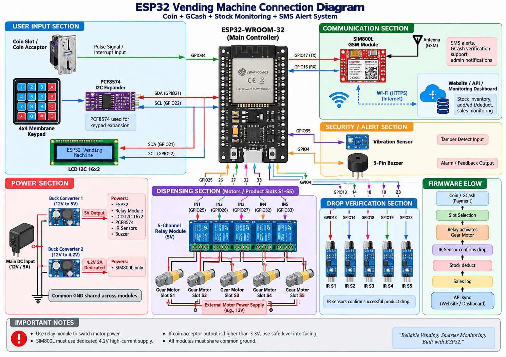

> **Important:** `connection.png` is a system overview only. Some GPIO labels in
> the image are from an older pin layout. Use the table below as the authoritative
> wiring reference because it matches
> [`4peace_esp32_firmware/config.h`](4peace_esp32_firmware/config.h).
# 4Peace Workflow

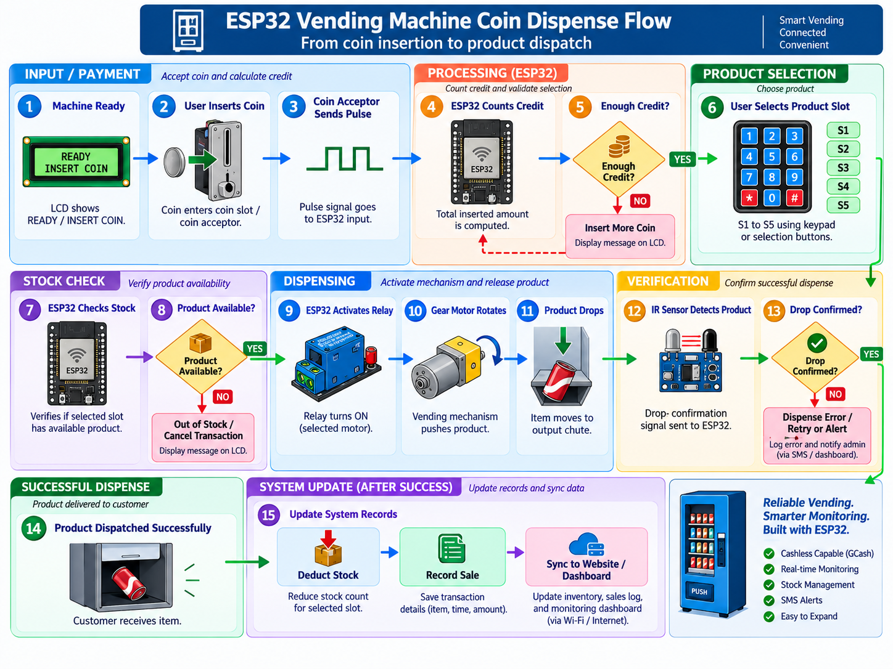

## Power rails and grounding

| Supply | Connect to | Use it for | Wiring rule |
| --- | --- | --- | --- |
| Main DC supply | Buck converter inputs and motor supply | Motors and step-down converters | Match this supply to the motor rating. The diagram shows a typical 12 V motor system. |
| Regulated 5 V | ESP32 `VIN` / `5V`, relay-board VCC, compatible peripherals | ESP32 board and 5 V relay coils | Do not power motors from the ESP32 or USB rail. |
| ESP32 3V3 | PCF8574, compatible LCD backpack, IR and tamper modules | Logic-level peripherals | ESP32 GPIO is 3.3 V only. Power a peripheral at 5 V only when its output is level-shifted to 3.3 V. |
| Dedicated 4.0–4.2 V, 2 A peak | SIM800L VCC | SIM800L only | Never power the SIM800L from ESP32 3V3 or the 5 V buck directly. |
| GND | ESP32 GND, module grounds, SIM800L GND, relay input ground | Shared logic reference | Join low-voltage grounds at a solid common/star ground. Keep motor-current wiring separate from sensitive logic wiring where possible. |

## Authoritative ESP32 connection table

| Function | Module terminal | ESP32 pin | Module voltage / signal level | Correct connection |
| --- | --- | --- | --- | --- |
| LCD I2C | SDA | GPIO21 | 3.3 V I2C | Connect LCD SDA and PCF8574 SDA to GPIO21. LCD address: `0x27`. |
| LCD I2C | SCL | GPIO22 | 3.3 V I2C | Connect LCD SCL and PCF8574 SCL to GPIO22. |
| 4×4 keypad | Keypad rows/columns | PCF8574 P0–P7 | 3.3 V | The keypad does **not** connect directly to ESP32 GPIO. Connect it to the PCF8574; PCF8574 address: `0x20`. |
| Coin acceptor | Pulse / signal output | GPIO26 | Must be level-shifted to 3.3 V | If the acceptor uses 12 V or 5 V pulses, use an optocoupler, transistor circuit, or level shifter before GPIO26. |
| Tamper / vibration sensor | Digital output | GPIO4 | 3.3 V, active LOW | Firmware uses `INPUT_PULLUP`. Connect a switch/sensor that pulls GPIO4 to GND when triggered. |
| Buzzer | Control input / transistor gate | GPIO25 | 3.3 V control | Use a transistor or MOSFET driver for a 5 V buzzer. Only a low-current 3.3 V active buzzer may connect directly. |
| Relay for Slot S1 | IN1 | GPIO13 | 3.3 V input-compatible, active LOW | Relay ON when GPIO13 is LOW. Relay switches motor power through COM/NO. |
| Relay for Slot S2 | IN2 | GPIO14 | 3.3 V input-compatible, active LOW | Relay ON when GPIO14 is LOW. |
| Relay for Slot S3 | IN3 | GPIO18 | 3.3 V input-compatible, active LOW | Relay ON when GPIO18 is LOW. |
| Relay for Slot S4 | IN4 | GPIO19 | 3.3 V input-compatible, active LOW | Relay ON when GPIO19 is LOW. |
| Relay for Slot S5 | IN5 | GPIO23 | 3.3 V input-compatible, active LOW | Relay ON when GPIO23 is LOW. |
| IR drop sensor S1 | OUT | GPIO34 | Maximum 3.3 V, active LOW | GPIO34 is input-only and has no internal pull-up. Use a sensor with a stable external output. |
| IR drop sensor S2 | OUT | GPIO35 | Maximum 3.3 V, active LOW | GPIO35 is input-only and has no internal pull-up. |
| IR drop sensor S3 | OUT | GPIO32 | Maximum 3.3 V, active LOW | Firmware treats LOW as a confirmed product drop. |
| IR drop sensor S4 | OUT | GPIO33 | Maximum 3.3 V, active LOW | Firmware treats LOW as a confirmed product drop. |
| IR drop sensor S5 | OUT | GPIO27 | Maximum 3.3 V, active LOW | Firmware treats LOW as a confirmed product drop. |
| SIM800L | TX | GPIO16 (ESP32 RX) | SIM800L logic, typically ~2.8 V | Connect SIM800L TX to GPIO16; share GND. |
| SIM800L | RX | GPIO17 (ESP32 TX) | Keep within SIM800L RX rating | Use a resistor divider or logic-level shifter from ESP32 GPIO17 to SIM800L RX. |
| Optional buck-voltage monitor #1 | Divider output | GPIO36 | Maximum 3.3 V at ESP32 pin | Use a resistor divider. With 100 kΩ/100 kΩ, 5 V becomes 2.5 V at GPIO36. |
| Optional buck-voltage monitor #2 | Divider output | GPIO39 | Maximum 3.3 V at ESP32 pin | Use a resistor divider. With 100 kΩ/100 kΩ, 4.2 V becomes 2.1 V at GPIO39. |

## Corrections to the cover image

The I2C and SIM800L labels in the image match the firmware. The following image
labels must be replaced with the firmware mapping before you wire the board:

| Image label | Correct firmware pin |
| --- | --- |
| Coin acceptor → GPIO34 | Coin acceptor → **GPIO26** |
| Vibration sensor → GPIO35 | Tamper/vibration sensor → **GPIO4** |
| Buzzer → GPIO4 | Buzzer → **GPIO25** |
| Relay IN1–IN5 → GPIO25, 26, 27, 32, 33 | Relay IN1–IN5 → **GPIO13, 14, 18, 19, 23** |
| IR S1–S5 → GPIO13, 14, 18, 19, 23 | IR S1–S5 → **GPIO34, 35, 32, 33, 27** |

## Detailed connection diagrams

The following diagrams are stored in `docs/images` and use the same GPIO map as
the firmware configuration.

### 1. LCD I2C — GPIO21 / GPIO22

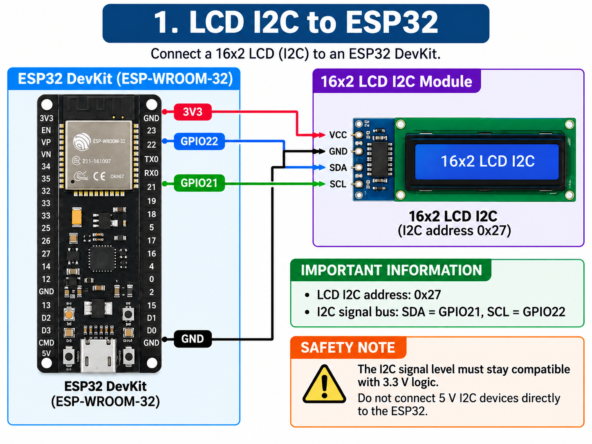

### 2. 4×4 keypad through PCF8574

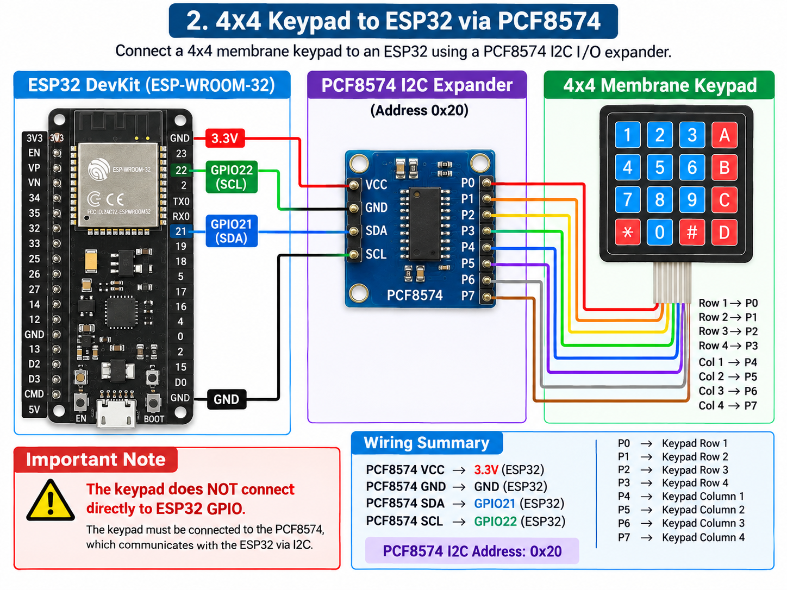

### 3. Coin acceptor — GPIO26

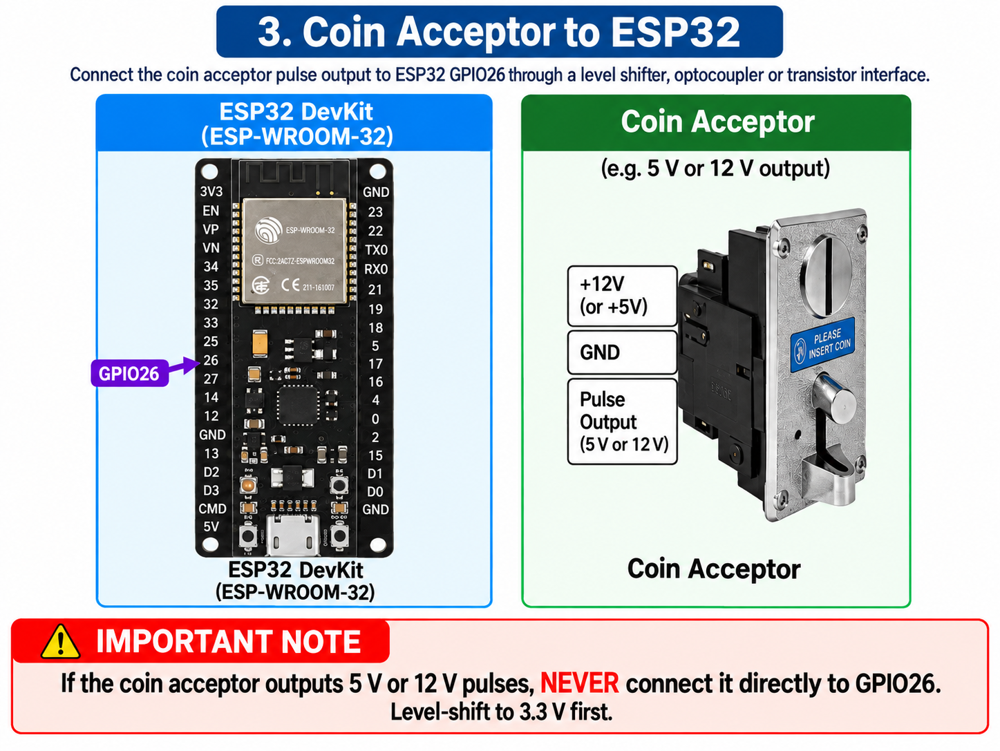

### 4. Tamper / vibration sensor — GPIO4

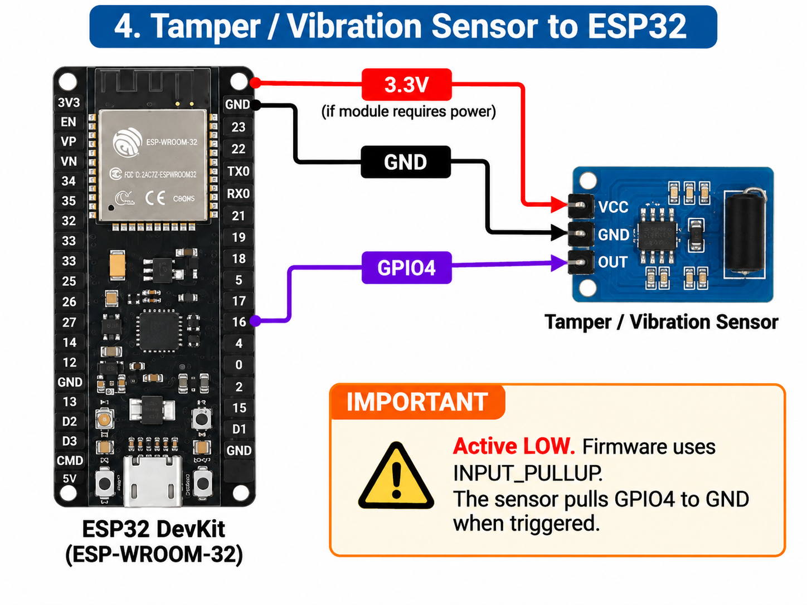

### 5. Buzzer — GPIO25

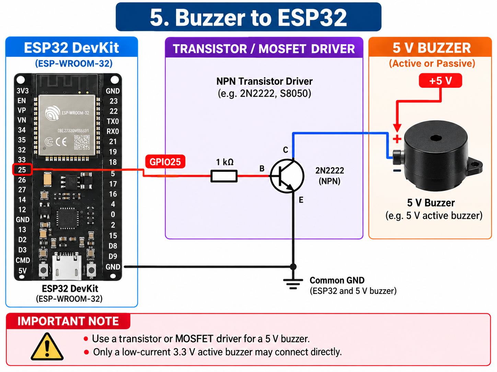

### 6. Relay module and vending motors

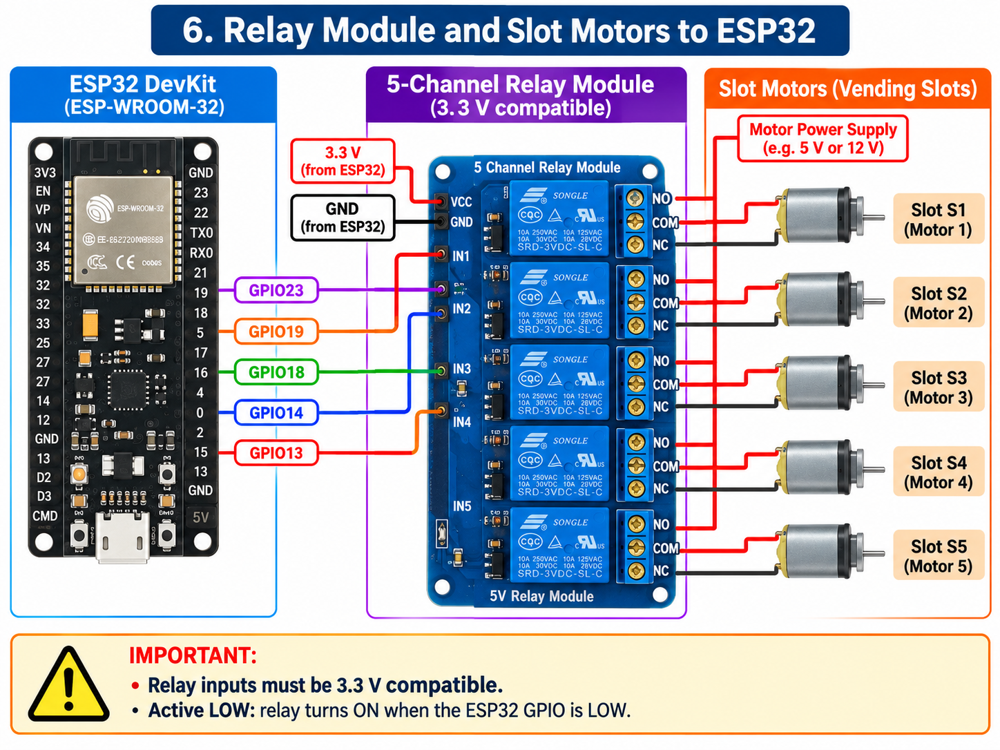

The firmware mapping is **IN1 = GPIO13**, **IN2 = GPIO14**, **IN3 = GPIO18**,
**IN4 = GPIO19**, and **IN5 = GPIO23**. Follow that order even if the visual
cable routing is hard to read. The diagram applies only to a relay board whose
inputs accept 3.3 V logic. A typical 5 V relay coil board still needs an external
5 V VCC supply; do not power relay coils from ESP32 3V3.

### 7. IR drop sensors S1 and S2 — GPIO34 / GPIO35

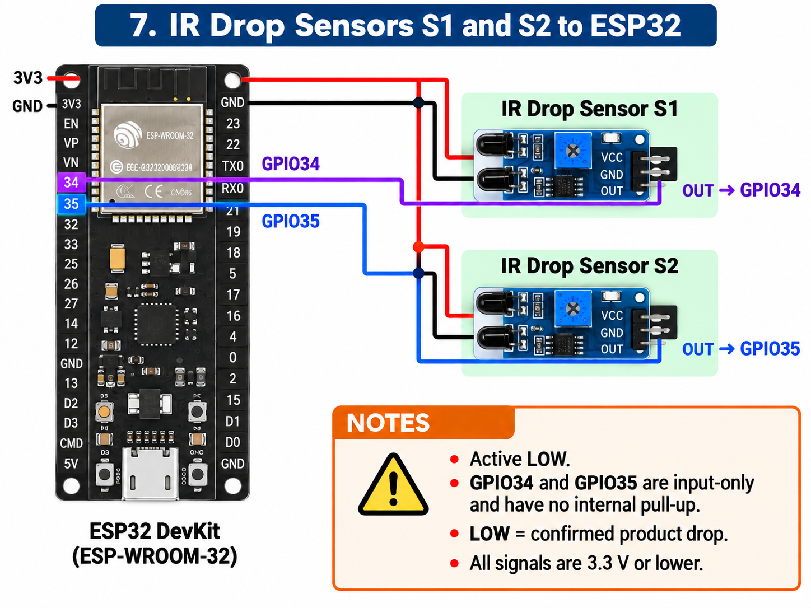

IR S3 and S4 use the same 3.3 V, active-LOW wiring on **GPIO32** and **GPIO33**.

### 8. IR drop sensor S5 — GPIO27

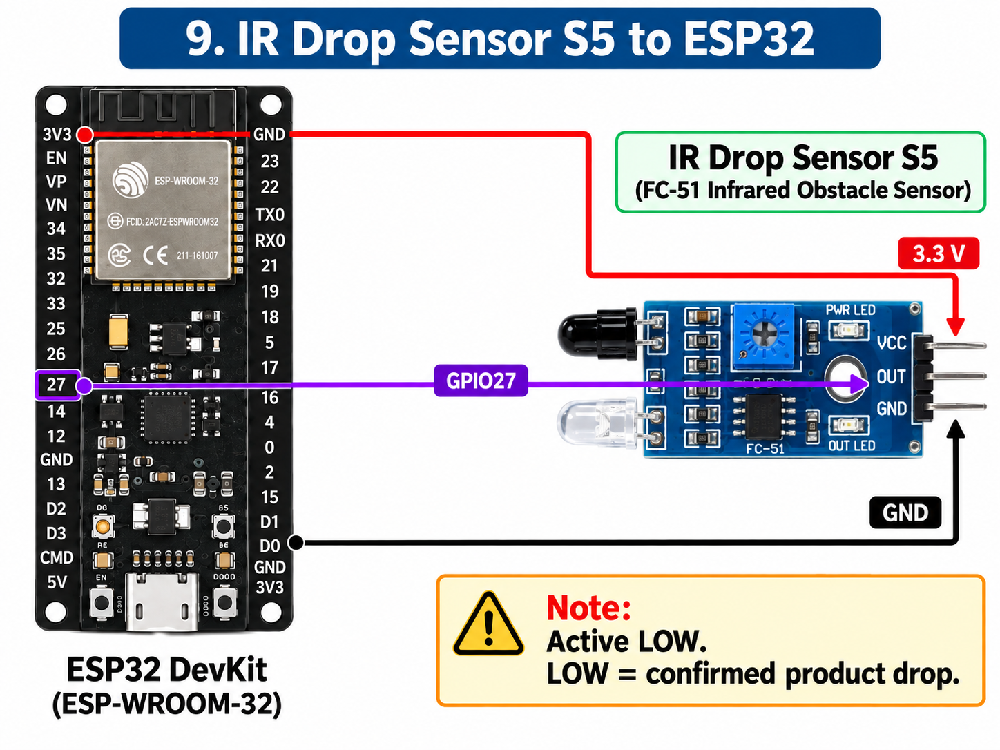

### 9. SIM800L — GPIO16 / GPIO17

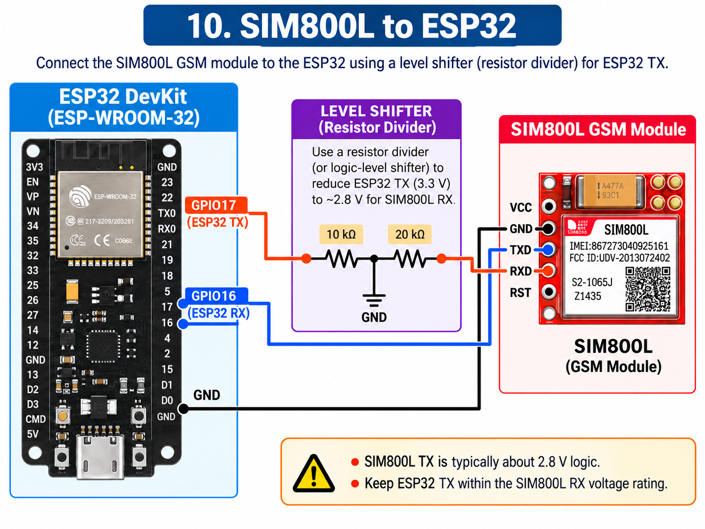

Use the resistor divider or logic-level shifter shown between ESP32 GPIO17 and
SIM800L RX. Power the SIM800L separately at 4.0–4.2 V with enough current for
transmit bursts.

## Upload firmware with Arduino IDE

1. Install **Arduino IDE 2.x** from [arduino.cc](https://www.arduino.cc/en/software).
2. Open **File → Preferences**. In **Additional Boards Manager URLs**, add:

   ```text
   https://espressif.github.io/arduino-esp32/package_esp32_index.json
   ```

3. Open **Tools → Board → Boards Manager**, search for `esp32`, then install
   **esp32 by Espressif Systems**. The firmware was verified using version `2.0.17`.
4. Open **Sketch → Include Library → Manage Libraries**, then install:

   - `ArduinoJson` version `6.21.5`
   - `LiquidCrystal I2C` version `1.1.2`

5. In the project folder, run the following command once to create or refresh
   the private firmware credentials file:

   ```powershell
   npm run firmware:configure
   ```

   This creates `firmware/4peace_esp32_firmware/config.local.h`. Confirm that
   the Wi-Fi SSID is a 2.4 GHz network; ESP32-WROOM-32 cannot join 5 GHz-only
   Wi-Fi.

6. Connect the ESP32 with a **data-capable USB cable**. Disconnect relay and
   motor power for the first upload and boot test.
7. Open this exact sketch in Arduino IDE:

   ```text
   firmware/4peace_esp32_firmware/4peace_esp32_firmware.ino
   ```

   Arduino IDE will automatically load the numbered tabs in the same folder.
8. Select **Tools → Board → esp32 → ESP32 Dev Module**. Under **Tools → Port**,
   choose the COM port that appears after plugging in the ESP32.
9. Click **Verify**. A successful build should be close to the previously
   verified size: about `960,697 bytes` flash and `48,248 bytes` RAM.
10. Click **Upload**. If it stays on `Connecting...`, hold the board's **BOOT**
    button until writing begins, then release it. Some ESP32 boards require
    this manual bootloader step.
11. Open **Tools → Serial Monitor**, set the speed to **115200 baud**, and press
    the board **EN/RESET** button once.
12. Check the startup output. A normal online boot shows messages similar to:

    ```text
    4Peace Vending — FIXED Firmware Starting
    [WiFi] Connected: ...
    [CLOUD] Config=OK Stock=OK Health=OK
    ```

    `Config=OK`, `Stock=OK`, and `Health=OK` confirm the firmware reached
    Supabase. If Wi-Fi is unavailable, the device can still boot into local
    vending mode and retry later.
13. Reconnect relay and motor power only after the LCD, keypad, Wi-Fi, and
    Serial Monitor output work correctly. Test one slot at a time before using
    all five motors.

## Safety checks before power-on

1. Confirm every ESP32-connected output is 3.3 V or lower. GPIOs are not 5 V tolerant.
2. Check I2C pull-ups: a 5 V LCD/PCF8574 backpack can pull SDA/SCL to 5 V. Use a 3.3 V-compatible backpack or an I2C level shifter.
3. Confirm the relay board accepts a 3.3 V control signal; add a driver/level shifter if it does not.
4. Connect each motor through the corresponding relay COM/NO terminals and the external motor supply, never through an ESP32 GPIO.
5. Power the SIM800L from its dedicated 4.0–4.2 V supply before testing SMS.
6. Test one relay and one IR sensor at a time with motors disconnected before a full vending test.
